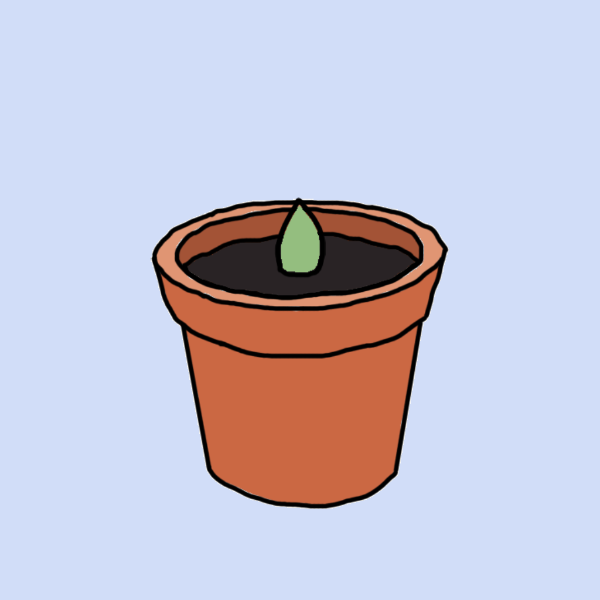

# Fill the Greenhouse

## Introduction
Fill the Greenhouse is a single-player simulation game created as a semester-long class project for Software Design and Development (COMP 225) built in GoDot by Frances McConnell, Nurain Jiwani, Justin Potts, and Kelly Lozano Analco. 

## Setup
Get started by [installing GoDot](https://godotengine.org/download/) and opening project.godot in GoDot.

## References
Godot Documentation: https://docs.godotengine.org/en/stable/index.html
